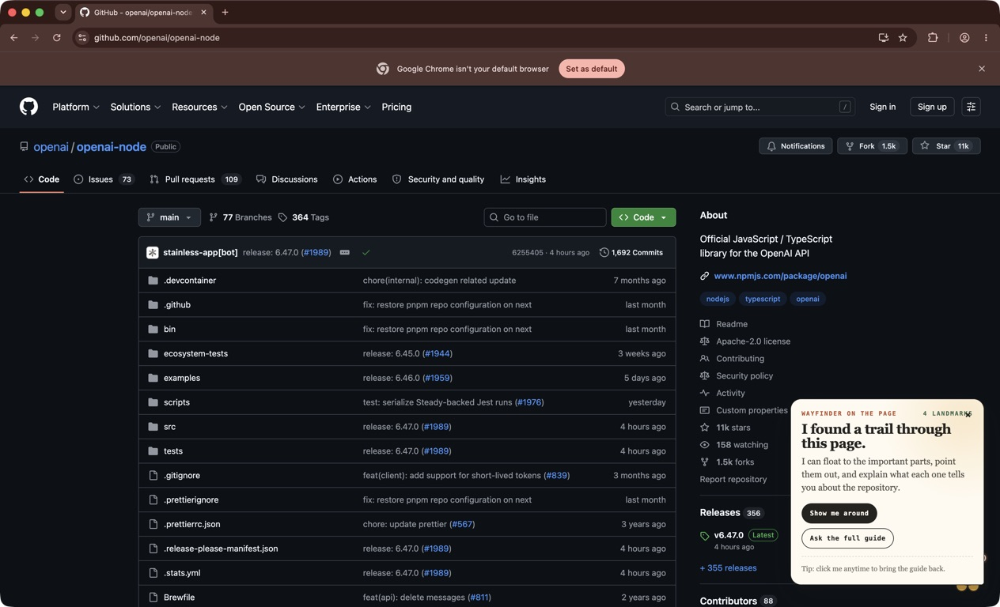
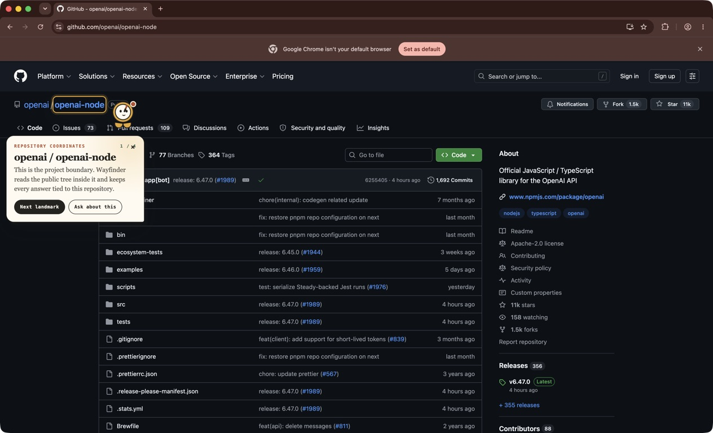

<p align="center">
  
</p>

<h1 align="center">Wayfinder</h1>

<p align="center"><strong>Evidence-first repository guidance, directly on GitHub.</strong></p>

<p align="center">
  <a href="https://github.com/Robertg761/Wayfinder/actions/workflows/ci.yml"></a>
  <a href="LICENSE"></a>
  
  
</p>

Wayfinder is a floating repository guide for public GitHub projects. Its compass
helper points to real page landmarks, explains what they reveal, and expands
into a complete repository agent without making the user leave GitHub.

Ask how to install a project, where a feature lives, what a file depends on, or
how to plan a contribution. Wayfinder answers with commit-pinned paths,
source-backed commands, confidence labels, and links that open the exact
evidence.

| Guided tour | Repository landmark |
|---|---|
|  |  |

## Why Wayfinder

GitHub exposes every file, but it rarely tells a newcomer what to read first,
which setup path applies to them, or where a contribution should begin.
Wayfinder turns those scattered clues into a navigable trail.

| Experience | Best for | What it does |
|---|---|---|
| **Guided** | New contributors | Moves through visible GitHub landmarks and teaches the repository one step at a time. |
| **Quick** | Experienced developers | Opens a compact repository snapshot and focused task shortcuts without moving around the page. |
| **Trail Plan** | A concrete change | Combines sourced setup, likely implementation files, related verification, and an ordered reading route. |

The deterministic tools remain fully useful without an OpenAI key. When the
Worker is configured for GPT-5.6 Luna, contribution plans can receive an
additional structured synthesis. Structured model output (evidence paths and
brief steps) is strictly validated against the deterministic evidence and the
whole synthesis is rejected on any mismatch; free-form prose is additionally
screened by heuristics for unsupported paths and command shapes, which blocks
common cases but is not a guarantee.

## Try it locally

Wayfinder is not yet distributed through the Chrome Web Store. Build and load
the production extension from source:

```bash
git clone https://github.com/Robertg761/Wayfinder.git
cd Wayfinder
corepack enable
pnpm install
pnpm --filter @wayfinder/extension build
```

Then:

1. Open `chrome://extensions`.
2. Enable **Developer mode**.
3. Select **Load unpacked**.
4. Choose `apps/extension/.output/chrome-mv3`.
5. Open a public GitHub repository.

Choose **Guide me** for the landmark tour or **Quick map** for the compact
developer surface. `Alt + Shift + W` opens and closes Wayfinder from the
keyboard.

Production builds call the public Worker at
[wayfinder-api.hopit-robert.workers.dev](https://wayfinder-api.hopit-robert.workers.dev/health).
No local Worker or API key is required for the deterministic public-repository
experience.

## What it can do

- map repository, tree, branch, tag, commit, directory, and file context
- preserve the requested ref and pin every answer to the resolved commit SHA
- summarize the project, stack, package manager, entry point, and key directories
- separate end-user installation from local contributor setup
- extract commands from authoritative repository-level setup evidence, verify consumer commands name the project, and label documented or inferred steps
- find likely implementation files with reasons, signals, confidence, and direct links
- classify the active file and answer summary, dependency, caller, test, and impact questions separately
- build a Trail Plan from a concrete contribution goal
- keep saved trails and recent evidence available across GitHub navigation or a temporary network failure
- guide users to the newest compatible GitHub Release without guessing their operating system or processor

## Evidence before prose

Wayfinder treats trust as a product feature:

1. Repository identities, refs, paths, sizes, and timestamps are validated at
   the Worker boundary.
2. Commands carry a repository source and inferred commands are labeled.
3. File relationships require target-specific evidence; possible matches do
   not become headline claims.
4. Model responses use strict structured output and an exact evidence
   allow-list.
5. Missing credentials, exhausted allowance, invalid model output, or upstream
   failure returns the deterministic answer instead of breaking the task.

See [Architecture](docs/ARCHITECTURE.md) for the complete trust boundary and
[Privacy](PRIVACY.md) for data flow and retention.

## Architecture

```text
GitHub page
  └─ Chrome extension (WXT + Shadow DOM)
       ├─ visible landmark guide
       ├─ local commit-aware cache
       └─ public Worker request
            ├─ GitHub repository mapper
            ├─ deterministic tour, install, find, and file-context tools
            ├─ contribution orchestrator
            └─ optional GPT-5.6 Luna synthesis
```

| Workspace | Responsibility |
|---|---|
| `apps/extension` | Manifest V3 extension, page helper, navigation, caching, and evidence UI |
| `apps/api` | Cloudflare Worker, GitHub retrieval, deterministic tools, model guardrails, and budget controls |
| `packages/contracts` | Shared request, response, repository-map, and answer contracts |
| `tests/browser` | Full extension workflows against deterministic GitHub fixtures |
| `scripts/verify-public.mjs` | Repeatable semantic matrix against real public repositories |

## Local development

Requirements: Node.js 22 or newer and pnpm 10.

```bash
pnpm install
cp apps/api/.dev.vars.example apps/api/.dev.vars
```

Both credentials are optional for public-repository development:

```text
GITHUB_TOKEN=
OPENAI_API_KEY=
OPENAI_REASONING_EFFORT=low
```

Start the Worker and extension in separate terminals:

```bash
pnpm dev:api
pnpm dev:extension
```

Development extension builds use `http://localhost:8787`. Set
`WXT_WAYFINDER_API_URL` to test another Worker origin.

### Worker routes

| Route | Purpose |
|---|---|
| `GET /health` | Deployment, model, limiter, and budget status |
| `POST /map` | Repository metadata, tree, README, setup, and commit mapping |
| `POST /tour` | Deterministic page-landmark tour |
| `POST /guide/install` | Consumer or contributor setup evidence |
| `POST /find` | Context-aware repository file discovery |
| `POST /agent` | Intent routing, file context, Trail Plan, and optional Luna synthesis |

## Verification

```bash
pnpm typecheck
pnpm test
pnpm test:browser
pnpm build
pnpm --filter @wayfinder/extension zip
```

The browser suite launches Chromium with the unpacked extension and covers
reloads, GitHub SPA navigation, narrow and dark layouts, keyboard behavior,
reduced motion, setup intent, release selection, evidence navigation, cache
isolation, and failure recovery.

After deploying the Worker, run the real-repository matrix:

```bash
pnpm smoke:public node python rust go monorepo
```

The matrix currently covers `openai/openai-node`, `pallets/flask`,
`BurntSushi/ripgrep`, `cli/cli`, and `vercel/next.js`. Results and pinned
coordinates are recorded in [Verification matrix](docs/VERIFICATION_MATRIX.md).

The optional live Luna evaluation requires `OPENAI_API_KEY`:

```bash
pnpm eval:luna
```

## Project documentation

- [Product plan](PRODUCT_PLAN.md)
- [Build Week plan](BUILD_WEEK_PLAN.md)
- [Architecture and trust boundary](docs/ARCHITECTURE.md)
- [Demo script](docs/DEMO_SCRIPT.md)
- [Devpost submission draft](docs/DEVPOST_SUBMISSION.md)
- [Ship checklist](docs/SHIP_CHECKLIST.md)
- [Public verification matrix](docs/VERIFICATION_MATRIX.md)
- [Luna evaluation](docs/LUNA_EVALUATION.md)
- [Contributing](CONTRIBUTING.md)
- [Security policy](SECURITY.md)
- [Privacy statement](PRIVACY.md)

## Contributing

Issues and pull requests are welcome. Start with
[CONTRIBUTING.md](CONTRIBUTING.md), preserve the evidence rules, and include a
focused regression whenever ranking or repository-task behavior changes.

## License

Wayfinder is available under the [MIT License](LICENSE).
