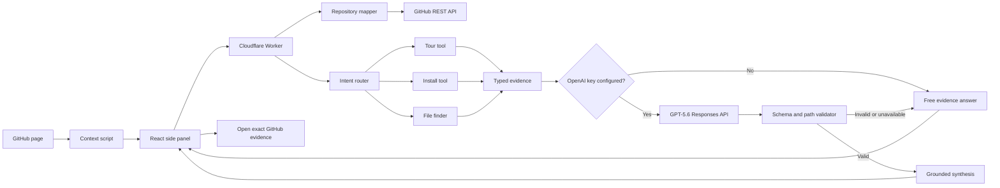

# Wayfinder Architecture

Wayfinder separates repository facts from language-model prose. Deterministic tools decide what files, commands, lines, and confidence labels are supported. GPT-5.6 can explain those results, but it cannot add a repository coordinate that the tools did not provide.

## Extension

The WXT Manifest V3 extension reads the active GitHub repository, branch or commit, directory, file, and view. A side panel keeps the guide visible while the user navigates. Every answer card can open its evidence at the mapped commit, including line fragments when available.

Recent repository maps and answers are cached in `chrome.storage.local`. Cache keys include the commit SHA, so evidence from one revision is not silently reused for another.

The Worker also asks Cloudflare to edge-cache unauthenticated GitHub subrequests. Mutable metadata, README, and branch tree responses use a five-minute TTL. File responses addressed by a full commit SHA use a 24-hour TTL. Error responses are excluded, and any request carrying a GitHub token explicitly bypasses shared caching.

## Worker tools

The Cloudflare Worker exposes six routes:

- `GET /health` reports service and model configuration state.
- `POST /map` reads metadata, README content, setup landmarks, and a filtered repository tree.
- `POST /tour` builds a deterministic reading route.
- `POST /guide/install` extracts documented or manifest-backed setup commands with confidence labels.
- `POST /find` ranks paths, then inspects only the strongest small text candidates for content and symbols.
- `POST /agent` classifies the question, runs one typed tool, and optionally requests GPT-5.6 synthesis.

This edge layer reduces repeated GitHub quota use without caching user questions, generated answers, or authenticated repository data.

## GPT-5.6 boundary

The OpenAI key exists only in the Worker environment. The model request uses the Responses API with:

- model `gpt-5.6` by default
- medium reasoning effort
- strict JSON Schema output
- `store: false`
- the deterministic answer as the only repository evidence
- a maximum of five evidence paths

The Worker parses the structured result and rejects the entire synthesis if any model path is absent from the tool output. It also falls back when the key is missing, the API is unavailable, the response is refused or malformed, or local validation fails.

## Deployment

- Worker: `https://wayfinder-api.hopit-robert.workers.dev`
- Chrome archive: `apps/extension/.output/wayfinderextension-0.1.0-chrome.zip`
- Local Worker: `http://localhost:8787`
- Local extension server: `http://localhost:3000`

Production builds select the public Worker automatically. Development builds use the local Worker unless `WXT_WAYFINDER_API_URL` overrides it.
