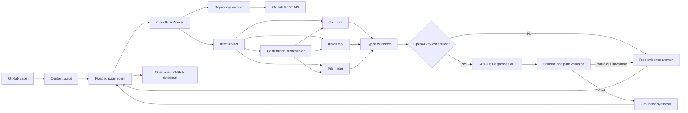

# Wayfinder Architecture

Wayfinder separates repository facts from language-model prose. Deterministic tools decide what files, commands, lines, and confidence labels are supported. GPT-5.6 can explain those results, but it cannot add a repository coordinate that the tools did not provide.

## Extension

The WXT Manifest V3 extension reads the active GitHub repository, branch or commit, directory, file, and view. It reads GitHub's rendered branch control even when that control is outside the viewport, preserving branch names that contain slashes after scrolling. The requested ref is sent to the Worker, resolved into an immutable commit SHA, and shown in answer provenance. The Worker fetches the tree, root fallback, and README through that SHA, so a branch update cannot mix evidence from two commits inside one map. A Shadow DOM page agent stays isolated from GitHub styles, discovers visible landmarks, moves beside them only during a contextual tour, and expands in place for deeper questions. Every answer card can open its evidence at the mapped commit, including line fragments when available.

The page helper mounts after `DOMContentLoaded` so it cannot interfere with GitHub's parser. It watches Turbo navigation, recalculates valid targets for repository and blob views, respects reduced-motion preferences, caches maps and answers in extension storage, and calls the Worker directly from the active GitHub page. The character and bubble share one positioned dock, so opening, closing, asking, and changing answer content cannot separate them. Route changes cancel any in-progress dock transition. Agent interactions keep the dock stationary. Landmark tours scroll first, move the complete dock with a 1.2-second non-overshooting transition, and reveal the explanation only after it arrives.

Preferences store Guided or Quick mode and repositories already introduced to the user. Quick mode does not auto-open on repeat visits. Saved trails retain the last answer and question for each repository, allowing evidence navigation to return to the same task. A ref change invalidates the in-memory map and answer unless the navigation is to the answer's own pinned SHA.

Recent repository maps and answers are cached in `chrome.storage.local`. Versioned repository cache keys include the requested ref, and versioned answer cache keys include the resolved SHA, so evidence from one revision or response contract is not silently reused for another. Short-lived pending file and release navigation lives in `sessionStorage`, which is scoped to one browser tab.

The Worker also asks Cloudflare to edge-cache unauthenticated GitHub subrequests. Mutable metadata, README, and branch tree responses use a five-minute TTL. File responses addressed by a full commit SHA use a 24-hour TTL. Error responses are excluded, and any request carrying a GitHub token explicitly bypasses shared caching.

## Worker tools

The Cloudflare Worker exposes six routes:

- `GET /health` reports service and model configuration state.
- `POST /map` resolves an optional requested ref, then reads metadata, README content, setup landmarks, and a filtered repository tree from that version.
- `POST /tour` builds a deterministic reading route.
- `POST /guide/install` extracts either consumer or contributor setup commands with confidence labels.
- `POST /find` ranks paths, then inspects only the strongest small text candidates for content and symbols.
- `POST /agent` classifies the question, runs one typed tool for focused questions, separates current-file summary, dependency, caller, test, and impact actions, or orchestrates tour, install, implementation, and verification evidence for a contribution goal. Current-file analysis classifies source, test, documentation, configuration, data, and other files before extracting evidence. It then optionally requests GPT-5.6 synthesis for contribution plans only.

Current-file relationship searches fail closed. Caller candidates must contain the distinctive target term in inspected content, paired tests must carry target-specific path or content evidence, and `possible` matches are discarded. Non-source files never enter the source caller/test graph. Content fetch failures and truncated repository maps remain visible as warnings, and the extension cache key is versioned when the answer contract changes so stale claims do not survive a deployment.

Plain installation questions are treated as end-user requests. Test, build, dependency, package-manager, local-run, development, and contribution wording selects repository development setup. Repository-wide guidance is drawn only from root manifests and documentation plus explicitly named setup documents, so a nested package or tool README cannot leak commands into the project plan. Documented consumer commands are recognized across JavaScript, Python, Rust, Go, Homebrew, and other system package managers, but must reference the mapped product; workspace installs and unrelated development tools remain on the development path. Documented sequences retain their source order when manifest-backed prerequisites are inserted. When no consumer command is documented, the extension conditionally checks Releases without claiming an installer exists. On the Releases page, the content script scopes candidates to the newest release card, uses the detected desktop OS and architecture only when reliable, asks for either value when ambiguous, rejects source archives and cross-platform or cross-architecture mismatches, and never falls through to an older release. Evidence links use the same per-tab navigation mechanism for repository files.

This edge layer reduces repeated GitHub quota use without caching user questions, generated answers, or authenticated repository data.

## Public request boundary

Repository maps posted back by the extension are treated as untrusted input. The Worker revalidates repository identities, hexadecimal commit SHAs, timestamps, text sizes, tree counts, file sizes, and every repository path before running a tool. Paths must be normalized relative paths without empty, control, `.` or `..` segments. Oversized bodies, malformed JSON, and contract violations return a client error before any repository tool runs. A dedicated Cloudflare binding limits each public POST route to 60 requests per connection per minute without consuming the separate model allowance.

A missing README is an allowed repository shape. GitHub rate limits, authentication failures, permission-denied 403 responses, malformed upstream responses, timeouts, and network failures remain distinct typed failures, so the extension can show the correct retry or fallback state. GitHub subrequests time out after 12 seconds, OpenAI synthesis after 30 seconds, and extension requests after 30 seconds.

The content script mounts at document idle and checks URL identity without observing GitHub's entire document tree. Every navigation invalidates the active request token, aborts in-flight network work, clears tour state, and rebuilds the open helper surface from the new repository or file context. This prevents an older response or tour control from being applied to a newer GitHub page.

## Contract versioning

The wire shapes live in `packages/contracts` as zod schemas; both apps derive their TypeScript types from those schemas with `z.infer`, so a shape can only change in one place. The Worker validates every inbound request body against the shared schemas, and the extension validates every response and every cached payload the same way, discarding values that no longer conform.

Version negotiation is deliberately minimal:

- `CONTRACT_VERSION` (in `packages/contracts`) is bumped on any incompatible wire change.
- The Worker sends it on every response as the `X-Wayfinder-Contract-Version` header and as the `contractVersion` field of `/health`.
- The extension identifies itself with an `X-Wayfinder-Extension-Version` request header (its manifest version), giving the Worker's logs the client-version dimension needed to decide when an old contract can be retired.

A response that fails schema validation is treated as a contract mismatch: the extension shows a retryable error suggesting an extension update rather than rendering unvalidated data.

## GPT-5.6 boundary

The OpenAI key exists only in the Worker environment. The model request uses the Responses API with:

- model fixed to `gpt-5.6-luna`
- low reasoning effort by default, with medium and high available for controlled evaluation
- paid synthesis only for contribution Trail Plans
- strict JSON Schema output
- `store: false`
- the deterministic answer as the only repository evidence
- a maximum of five evidence paths
- a maximum of four ordered field-brief actions
- a Cloudflare rate-limit allowance before any paid request
- a serialized global budget reservation before any paid request

The Worker parses the structured result and rejects the entire synthesis if any model citation, field-brief path, path-like prose, or shell command is absent from the credible deterministic output. Paths backed only by a `possible` match are excluded from the allow-list. The prompt also distinguishes a pinned repository path from a verified relationship. The extension describes accepted prose as AI synthesis and states only that evidence links were verified. Wayfinder falls back when the key is missing, the API is unavailable, the response is refused or malformed, or local validation fails.

Successful model answers include token counts, latency, reasoning tokens, and an estimated Luna API cost. Focused orientation, installation, and file-location questions never request a model allowance. Their deterministic tools already answer the job directly.

Paid synthesis is fail-closed behind `MODEL_RATE_LIMITER` and `MODEL_BUDGET`. The rate-limit binding permits 10 attempts per connecting-IP key per minute in each Cloudflare location. The SQLite-backed Durable Object serializes all paid requests globally and persists its ledger across Worker deployments. Before a request leaves the Worker, it reserves a conservative cost based on request bytes, output limits, protocol overhead, and a safety multiplier. A successful response reconciles that reservation to reported Luna token usage. Missing usage or failed reconciliation keeps the larger reservation.

The lifetime budget is the full `$100` event credit balance, including the verified pre-guard evaluation spend. When the budget is exhausted or either protection is unavailable, Wayfinder returns the completed deterministic answer. `GET /health` reports rate-limit protection, budget protection, effective model enablement, spent budget, reserved budget, and remaining budget.

## Deployment

- Worker: `https://wayfinder-api.hopit-robert.workers.dev`
- Chrome archive: `apps/extension/.output/wayfinderextension-0.1.0-chrome.zip`
- Local Worker: `http://localhost:8787`
- Local extension server: `http://localhost:3000`

Production builds select the public Worker automatically. Development builds use the local Worker unless `WXT_WAYFINDER_API_URL` overrides it. `GET /health` exposes Cloudflare version metadata, and `pnpm smoke:public` asserts the deterministic rate-limit guard plus task semantics before a Worker version is recorded as verified.
