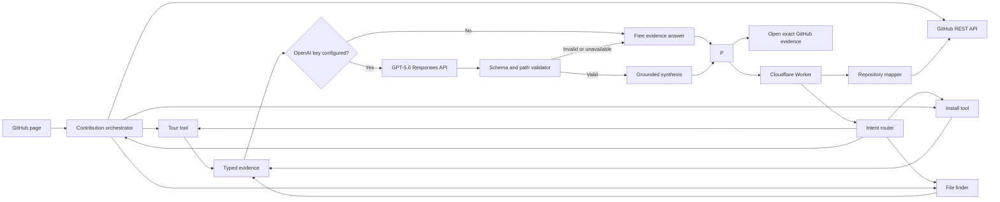

# Wayfinder Architecture

Wayfinder separates repository facts from language-model prose. Deterministic tools decide what files, commands, lines, and confidence labels are supported. GPT-5.6 can explain those results, but it cannot add a repository coordinate that the tools did not provide.

## Extension

The WXT Manifest V3 extension reads the active GitHub repository, branch or commit, directory, file, and view. A Shadow DOM page agent stays isolated from GitHub styles, discovers visible landmarks, moves beside them during a contextual tour, and expands in place for deeper questions. Every answer card can open its evidence at the mapped commit, including line fragments when available.

The page helper mounts after `DOMContentLoaded` so it cannot interfere with GitHub's parser. It watches Turbo navigation, recalculates valid targets for repository and blob views, respects reduced-motion preferences, caches maps and answers in extension storage, and calls the Worker directly from the active GitHub page.

Recent repository maps and answers are cached in `chrome.storage.local`. Cache keys include the commit SHA, so evidence from one revision is not silently reused for another.

The Worker also asks Cloudflare to edge-cache unauthenticated GitHub subrequests. Mutable metadata, README, and branch tree responses use a five-minute TTL. File responses addressed by a full commit SHA use a 24-hour TTL. Error responses are excluded, and any request carrying a GitHub token explicitly bypasses shared caching.

## Worker tools

The Cloudflare Worker exposes six routes:

- `GET /health` reports service and model configuration state.
- `POST /map` reads metadata, README content, setup landmarks, and a filtered repository tree.
- `POST /tour` builds a deterministic reading route.
- `POST /guide/install` extracts documented or manifest-backed setup commands with confidence labels.
- `POST /find` ranks paths, then inspects only the strongest small text candidates for content and symbols.
- `POST /agent` classifies the question, runs one typed tool for focused questions, or orchestrates tour, install, implementation, and verification evidence for a contribution goal. It then optionally requests GPT-5.6 synthesis.

This edge layer reduces repeated GitHub quota use without caching user questions, generated answers, or authenticated repository data.

## Public request boundary

Repository maps posted back by the extension are treated as untrusted input. The Worker revalidates repository identities, hexadecimal commit SHAs, timestamps, text sizes, tree counts, file sizes, and every repository path before running a tool. Paths must be normalized relative paths without empty, control, `.` or `..` segments. Malformed JSON and contract violations return a client error before any repository tool runs.

A missing README is an allowed repository shape. GitHub rate limits, authentication failures, malformed upstream responses, and network failures are not converted into a missing README, so the extension can show the correct retry or fallback state.

## GPT-5.6 boundary

The OpenAI key exists only in the Worker environment. The model request uses the Responses API with:

- model fixed to `gpt-5.6-luna`
- low reasoning effort by default, with medium and high available for controlled evaluation
- paid synthesis only for contribution Trail Plans
- strict JSON Schema output
- `store: false`
- the deterministic answer as the only repository evidence
- a maximum of five evidence paths
- a maximum of four ordered field-brief actions
- a Cloudflare rate-limit allowance before any paid request
- a serialized global budget reservation before any paid request

The Worker parses the structured result and rejects the entire synthesis if any model citation or field-brief path is absent from the tool output. It also falls back when the key is missing, the API is unavailable, the response is refused or malformed, or local validation fails.

Successful model answers include token counts, latency, reasoning tokens, and an estimated Luna API cost. Focused orientation, installation, and file-location questions never request a model allowance. Their deterministic tools already answer the job directly.

Paid synthesis is fail-closed behind `MODEL_RATE_LIMITER` and `MODEL_BUDGET`. The rate-limit binding permits 10 attempts per connecting-IP key per minute in each Cloudflare location. The SQLite-backed Durable Object serializes all paid requests globally and persists its ledger across Worker deployments. Before a request leaves the Worker, it reserves a conservative cost based on request bytes, output limits, protocol overhead, and a safety multiplier. A successful response reconciles that reservation to reported Luna token usage. Missing usage or failed reconciliation keeps the larger reservation.

The lifetime budget is the full `$100` event credit balance, including the verified pre-guard evaluation spend. When the budget is exhausted or either protection is unavailable, Wayfinder returns the completed deterministic answer. `GET /health` reports rate-limit protection, budget protection, effective model enablement, spent budget, reserved budget, and remaining budget.

## Deployment

- Worker: `https://wayfinder-api.hopit-robert.workers.dev`
- Chrome archive: `apps/extension/.output/wayfinderextension-0.1.0-chrome.zip`
- Local Worker: `http://localhost:8787`
- Local extension server: `http://localhost:3000`

Production builds select the public Worker automatically. Development builds use the local Worker unless `WXT_WAYFINDER_API_URL` overrides it.
